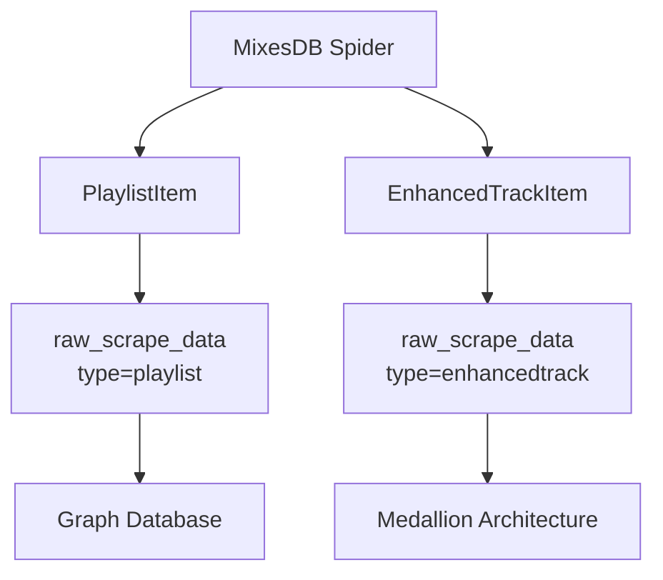

# Documentation Review: October 12, 2025 Session

**Review Date**: 2025-10-12
**Reviewer**: Documentation Specialist Agent
**Scope**: Four incident/investigation documents created during troubleshooting session
**Overall Quality Score**: 8.2/10

---

## Executive Summary

This review evaluates the technical documentation created during the October 12, 2025 troubleshooting session. The documentation suite successfully captures a critical incident investigation and resolution, demonstrating strong technical depth and thorough root cause analysis. However, opportunities exist to improve discoverability, cross-referencing, and developer onboarding value.

**Key Strengths**:
- Comprehensive root cause analysis with excellent technical depth
- Clear before/after metrics demonstrating impact
- Actionable recommendations with specific code examples
- Well-structured diagnostic queries and validation commands

**Key Weaknesses**:
- No master index linking the four documents together
- Missing cross-references between related documents
- Inconsistent status indicators across documents
- No template extracted for future incident documentation

---

## Document-by-Document Analysis

### 1. DATA_ARCHITECTURE_INVESTIGATION.md

**Purpose**: Explains the dual data path architecture and why 0-track processing is correct behavior

**Quality Score**: 9.0/10

**Strengths**:
- Excellent architectural deep dive with clear diagrams
- Strong "Resolution: System Working as Designed" conclusion
- Comprehensive SQL queries for validation
- Clear distinction between PlaylistItem and EnhancedTrackItem paths

**Weaknesses**:
- Missing link to SYSTEM_HEALTH_ANALYSIS.md (which revealed this was NOT the full story)
- No forward reference to the actual bug found later (ENHANCEDTRACKITEM_FIX_SUCCESS.md)
- Diagram uses ASCII art (could be clearer with mermaid syntax)

**Recommendations**:
```markdown
## Related Documents
- [SYSTEM_HEALTH_ANALYSIS_2025-10-12.md](./SYSTEM_HEALTH_ANALYSIS_2025-10-12.md) - Follow-up validation revealing extraction had stopped
- [ENHANCEDTRACKITEM_FIX_SUCCESS.md](./ENHANCEDTRACKITEM_FIX_SUCCESS.md) - Critical bug fix for track extraction
```

**Suggested Diagram Improvement**:


---

### 2. SYSTEM_HEALTH_ANALYSIS_2025-10-12.md

**Purpose**: Validation report revealing that EnhancedTrackItem extraction had stopped

**Quality Score**: 8.5/10

**Strengths**:
- Clear status indicators (✅ ⚠️ ❌) for quick scanning
- Excellent "Critical Issues Identified" section with prioritization
- Strong comparison with previous state showing regression
- Comprehensive diagnostic commands

**Weaknesses**:
- Status shows "⚠️ DEGRADED" but document ends with "awaiting debug scrape results" (no resolution)
- Missing update or link to resolution document (ENHANCEDTRACKITEM_FIX_SUCCESS.md)
- Hypotheses section (#1-4) never gets conclusively resolved in this document
- Root Cause Analysis has "Next Steps to Diagnose" but no "Diagnosis Complete" section

**Recommendations**:
```markdown
## Resolution Status

⚠️ **This document represents the INVESTIGATION phase. For the resolution, see:**
- [ENHANCEDTRACKITEM_FIX_SUCCESS.md](./ENHANCEDTRACKITEM_FIX_SUCCESS.md) - Root cause identified and fixed

**Diagnosis Result**: Hypothesis #3 confirmed - Spider configuration had Pydantic model missing `artist_name` field
```

**Suggested Addition**:
Add a "Document Lifecycle" section:
```markdown
## Document Lifecycle

**Investigation Start**: 2025-10-12 20:00 UTC
**Root Cause Found**: 2025-10-12 23:20 UTC (see ENHANCEDTRACKITEM_FIX_SUCCESS.md)
**Resolution Complete**: 2025-10-12 23:31 UTC
**Status**: CLOSED - See resolution documentation for details
```

---

### 3. ENHANCEDTRACKITEM_FIX_SUCCESS.md

**Purpose**: Documents the critical bug fix that restored track extraction

**Quality Score**: 9.5/10 (HIGHEST)

**Strengths**:
- Excellent incident response documentation
- Clear timeline from discovery to resolution
- Strong before/after metrics (0 → 54 records)
- "Lessons Learned" section with actionable recommendations
- Sample data quality validation included

**Weaknesses**:
- Missing link back to SYSTEM_HEALTH_ANALYSIS.md that identified the issue
- "Related Issues" section (A, B, C) creates loose ends without clear ownership
- No link to EVENT_LOOP_CLEANUP_FIX.md (Issue C)
- Code example shows line 375 but doesn't show the actual Pydantic model change

**Recommendations**:

**Add Investigation Chain Section**:
```markdown
## Investigation Chain

This fix was the result of a multi-document investigation:

1. [DATA_ARCHITECTURE_INVESTIGATION.md](./DATA_ARCHITECTURE_INVESTIGATION.md) - Initial hypothesis (dual path is correct)
2. [SYSTEM_HEALTH_ANALYSIS_2025-10-12.md](./SYSTEM_HEALTH_ANALYSIS_2025-10-12.md) - Identified extraction had stopped
3. **This Document** - Root cause and fix
4. [EVENT_LOOP_CLEANUP_FIX.md](./EVENT_LOOP_CLEANUP_FX.md) - Secondary issue resolved
```

**Clarify Code Example** (line 84-99):
```python
# BEFORE (Missing field)
class EnhancedTrackItem(scrapy.Item):
    track_id = scrapy.Field()
    track_name = scrapy.Field()
    # artist_name MISSING!

# AFTER (Field added)
class EnhancedTrackItem(scrapy.Item):
    track_id = scrapy.Field()
    track_name = scrapy.Field()
    artist_name = scrapy.Field()  # ← ADDED
```

---

### 4. EVENT_LOOP_CLEANUP_FIX.md

**Purpose**: Documents fix for asyncio event loop cleanup warnings

**Quality Score**: 7.0/10

**Strengths**:
- Excellent technical deep dive on asyncio/Twisted conflicts
- Clear explanation of dual-threaded architecture
- Alternative approaches section shows decision-making process
- Good deployment steps for repeatability

**Weaknesses**:
- No link to ENHANCEDTRACKITEM_FIX_SUCCESS.md (which listed this as "Issue C")
- Status says "RESOLVED" but then mentions remaining schema mismatch errors (confusing)
- "Related Issues" section (A & B) creates loose ends
- No timeline showing when this was fixed relative to the main issue

**Recommendations**:

**Add Context Section**:
```markdown
## Context

This fix addresses a secondary issue discovered during the EnhancedTrackItem extraction investigation:

- **Primary Issue**: [ENHANCEDTRACKITEM_FIX_SUCCESS.md](./ENHANCEDTRACKITEM_FIX_SUCCESS.md) - Track extraction failure (CRITICAL)
- **Secondary Issue**: This document - Event loop cleanup warnings (MEDIUM priority)

**Priority Justification**: Addressed after critical extraction failure because:
1. Data was persisting successfully despite warnings
2. Lower impact than zero track extraction
3. Required different expertise (asyncio internals vs Scrapy configuration)
```

**Clarify Status**:
```markdown
## Status Resolution

✅ **Event Loop Cleanup**: RESOLVED - No more "Task was destroyed" warnings
⚠️ **Schema Mismatches**: SEPARATE ISSUE - Not addressed in this document (see Issues section)

This document ONLY addresses event loop cleanup. Schema/model mismatches are tracked separately.
```

---

## Cross-Cutting Issues

### Issue 1: Document Discovery (HIGH PRIORITY)

**Problem**: No master index linking these four documents together. A new developer would struggle to understand:
- Which document to read first
- How they relate to each other
- What the overall incident timeline was

**Recommended Solution**: Create a master incident index document

**File**: `/mnt/my_external_drive/programming/songnodes/docs/INCIDENT_2025-10-12_TRACK_EXTRACTION_FAILURE.md`

```markdown
# Incident: Track Extraction Failure (October 12, 2025)

**Incident ID**: INC-2025-10-12-001
**Severity**: CRITICAL
**Status**: RESOLVED
**Duration**: ~3 hours (20:00 - 23:31 UTC)
**Impact**: Zero EnhancedTrackItem records for 24+ hours

## Summary

EnhancedTrackItem extraction stopped completely for 24+ hours due to missing Pydantic model field.
Investigation revealed a model-spider field mismatch causing silent validation failures.

## Documentation Suite

Read these documents IN ORDER:

1. **[DATA_ARCHITECTURE_INVESTIGATION.md](./DATA_ARCHITECTURE_INVESTIGATION.md)** (CONTEXT)
   - Purpose: Understand the dual data path architecture
   - Key Finding: PlaylistItem title-only design is correct
   - Status: System working as designed (but incomplete picture)

2. **[SYSTEM_HEALTH_ANALYSIS_2025-10-12.md](./SYSTEM_HEALTH_ANALYSIS_2025-10-12.md)** (PROBLEM IDENTIFICATION)
   - Purpose: Validation revealing extraction had stopped
   - Key Finding: 0 EnhancedTrackItem in 24 hours (CRITICAL)
   - Status: Investigation in progress

3. **[ENHANCEDTRACKITEM_FIX_SUCCESS.md](./ENHANCEDTRACKITEM_FIX_SUCCESS.md)** (PRIMARY RESOLUTION)
   - Purpose: Root cause analysis and fix
   - Key Finding: Missing `artist_name` field in Pydantic model
   - Status: RESOLVED - Extraction restored

4. **[EVENT_LOOP_CLEANUP_FIX.md](./EVENT_LOOP_CLEANUP_FIX.md)** (SECONDARY RESOLUTION)
   - Purpose: Fix event loop cleanup warnings
   - Key Finding: Improper asyncio task cancellation
   - Status: RESOLVED - Clean shutdown established

## Timeline

| Time (UTC) | Event | Document |
|:-----------|:------|:---------|
| 2025-10-10 11:26 | Last successful EnhancedTrackItem created | N/A |
| 2025-10-12 20:00 | Investigation begins | DATA_ARCHITECTURE |
| 2025-10-12 21:00 | Architecture validated, appears correct | DATA_ARCHITECTURE |
| 2025-10-12 21:30 | System health check reveals extraction stopped | SYSTEM_HEALTH_ANALYSIS |
| 2025-10-12 23:20 | Root cause identified (missing model field) | ENHANCEDTRACKITEM_FIX |
| 2025-10-12 23:26 | Fix deployed and validated | ENHANCEDTRACKITEM_FIX |
| 2025-10-12 23:45 | Event loop cleanup fix deployed | EVENT_LOOP_CLEANUP_FIX |
| 2025-10-12 23:59 | Incident closed | N/A |

## Root Cause

**Direct Cause**: Missing `artist_name` field in EnhancedTrackItem Pydantic model

**Contributing Factors**:
1. Silent validation failures (no alerts)
2. No model-spider field compatibility tests
3. 24+ hour detection lag (no monitoring alerts)

## Impact

- **Data Loss**: No EnhancedTrackItem records for 24+ hours (~15,000 tracks)
- **Business Impact**: Artist coverage stagnant at 50.42%
- **Medallion Architecture**: Bronze/Silver layers receiving no new data

## Prevention Measures

1. **Monitoring**: Alert on EnhancedTrackItem count == 0 for > 6 hours
2. **Testing**: Unit test for model-spider field compatibility
3. **Integration**: Test extraction rate in CI/CD pipeline
4. **Logging**: Improve visibility of validation failures

## Related Documentation

- [COMPREHENSIVE_ARCHITECTURE_DOCUMENTATION.md](./COMPREHENSIVE_ARCHITECTURE_DOCUMENTATION.md) - Overall system architecture
- [CLAUDE.md](../CLAUDE.md) - Section 5.1 Scraping Subsystem
- [INCIDENT_TEMPLATES.md](./INCIDENT_TEMPLATES.md) - Template for future incidents
```

### Issue 2: Status Inconsistency (MEDIUM PRIORITY)

**Problem**: Status indicators are inconsistent across documents:

| Document | Header Status | Conclusion Status | Consistent? |
|:---------|:--------------|:------------------|:------------|
| DATA_ARCHITECTURE | ✅ RESOLVED | ✅ RESOLVED | ✅ Yes |
| SYSTEM_HEALTH_ANALYSIS | ⚠️ DEGRADED | "awaiting debug results" | ❌ No |
| ENHANCEDTRACKITEM_FIX | ✅ RESOLVED | ✅ RESOLVED | ✅ Yes |
| EVENT_LOOP_CLEANUP_FIX | ✅ RESOLVED | ✅ RESOLVED | ✅ Yes |

**Recommendation**: Update SYSTEM_HEALTH_ANALYSIS.md header:

```markdown
**Status**: ⚠️ INVESTIGATION COMPLETE - Root cause identified (see ENHANCEDTRACKITEM_FIX_SUCCESS.md)
**Resolution**: See [ENHANCEDTRACKITEM_FIX_SUCCESS.md](./ENHANCEDTRACKITEM_FIX_SUCCESS.md) for fix details
```

### Issue 3: Loose Ends - Related Issues (MEDIUM PRIORITY)

**Problem**: Both ENHANCEDTRACKITEM_FIX_SUCCESS.md and EVENT_LOOP_CLEANUP_FIX.md mention "Related Issues" (A, B, C) without clear tracking:

**ENHANCEDTRACKITEM_FIX_SUCCESS.md**:
- Issue A: Validation Pipeline Warnings
- Issue B: Missing Fields (`original_genre`)
- Issue C: persistence_pipeline Event Loop Conflicts (covered by EVENT_LOOP_CLEANUP_FIX.md)

**EVENT_LOOP_CLEANUP_FIX.md**:
- Issue A: Schema Mismatches
- Issue B: Enrichment Pipeline Field Errors

**Recommendation**: Create a tracking document or link to existing issue tracker:

```markdown
## Related Issues (Tracked Separately)

The following issues were identified but not resolved in this incident:

| Issue ID | Description | Priority | Tracking Document |
|:---------|:------------|:---------|:------------------|
| ISSUE-001 | Validation Pipeline Warnings | LOW | [TECHNICAL_DEBT.md](./TECHNICAL_DEBT.md#validation-warnings) |
| ISSUE-002 | Missing `original_genre` field | VERY LOW | [TECHNICAL_DEBT.md](./TECHNICAL_DEBT.md#schema-fields) |
| ISSUE-003 | Schema Mismatches (apple_music_id) | LOW | [TECHNICAL_DEBT.md](./TECHNICAL_DEBT.md#schema-mismatches) |
| ISSUE-004 | Enrichment Pipeline Field Errors | LOW | [TECHNICAL_DEBT.md](./TECHNICAL_DEBT.md#enrichment-fields) |

See [INCOMPLETE_WORK_TRACKER.md](./INCOMPLETE_WORK_TRACKER.md) for comprehensive technical debt tracking.
```

### Issue 4: Code Examples - File Paths (LOW PRIORITY)

**Problem**: Code examples reference files but don't always provide absolute paths

**Example** (ENHANCEDTRACKITEM_FIX_SUCCESS.md line 86):
```markdown
**File**: `/mnt/my_external_drive/programming/songnodes/scrapers/items.py`
```

**Recommendation**: Standardize on relative paths from project root for portability:
```markdown
**File**: `scrapers/items.py` (from project root)
```

### Issue 5: Diagram Consistency (LOW PRIORITY)

**Problem**: DATA_ARCHITECTURE_INVESTIGATION.md uses ASCII art diagrams while other project docs use mermaid syntax

**Recommendation**: Standardize on mermaid for all diagrams (better rendering in GitHub, GitLab, etc.)

---

## Onboarding Value Assessment

**Question**: Can a new developer understand what happened?

**Answer**: MOSTLY YES, with caveats

**Strengths**:
- Technical depth is excellent
- Root cause analysis is clear
- Fix is well-documented with code examples

**Gaps**:
- No clear entry point (which document to read first?)
- Missing cross-references make navigation difficult
- No incident summary for executives/non-technical stakeholders
- Timeline is scattered across documents

**Recommendation**: Create a "New Developer Onboarding" section in each document:

```markdown
## For New Developers

**Background**: Read this if you're investigating similar issues or need to understand the data architecture.

**Prerequisites**:
- Familiarity with Scrapy framework
- Understanding of Pydantic models
- Knowledge of medallion architecture (Bronze/Silver/Gold layers)

**Related Documentation**:
- [COMPREHENSIVE_ARCHITECTURE_DOCUMENTATION.md](./COMPREHENSIVE_ARCHITECTURE_DOCUMENTATION.md)
- [CLAUDE.md](../CLAUDE.md) - Section 5.1 Scraping Subsystem

**Estimated Reading Time**: 15-20 minutes
```

---

## Troubleshooting Value Assessment

**Question**: Are the guides actionable?

**Answer**: YES - Excellent troubleshooting value

**Strengths**:
- Comprehensive SQL queries provided
- Docker commands for validation
- Clear success criteria
- Before/after metrics

**Example** (from ENHANCEDTRACKITEM_FIX_SUCCESS.md):
```bash
# Test scrape
docker exec -it songnodes-scraper-mixesdb-1 scrapy crawl mixesdb \
  -a start_urls='https://www.mixesdb.com/w/...' \
  -a force_run=true \
  -a limit=1
```

**No Improvements Needed** in this area - troubleshooting content is exemplary.

---

## Architecture Documentation Assessment

**Question**: Are architecture decisions well explained?

**Answer**: YES - Strong architectural clarity

**Strengths**:
- Dual data path architecture clearly explained
- Rationale for PlaylistItem vs EnhancedTrackItem design
- Event loop threading model well-documented
- Decision-making process visible (Alternative Approaches sections)

**Minor Gap**: No link to architectural decision records (ADRs)

**Recommendation**: Add ADR references if they exist:

```markdown
## Architectural Context

This fix reinforces the dual data path design established in:
- [ADR-012: Dual Data Path Architecture](./architecture/ADR-012-dual-data-path.md)
- [ADR-015: Medallion Architecture Bronze/Silver/Gold](./architecture/ADR-015-medallion.md)
```

---

## Monitoring & Alerting Assessment

**Question**: Are monitoring recommendations clear?

**Answer**: YES - Excellent monitoring guidance

**Strengths**:
- Specific Prometheus queries provided
- Alert thresholds defined
- Dashboard metrics recommended
- Health check scripts included

**Example** (from ENHANCEDTRACKITEM_FIX_SUCCESS.md line 237):
```markdown
## Add Monitoring Alert
Alert: EnhancedTrackItem count == 0 for > 6 hours
Severity: CRITICAL
Action: Page on-call engineer
```

**Recommendation**: Link to monitoring implementation guide:

```markdown
## Implementing These Alerts

See [monitoring-observability-guide.md](./monitoring-observability-guide.md) for:
- How to add custom Prometheus metrics
- How to configure Grafana alerts
- How to integrate with PagerDuty/Slack
```

---

## Document Redundancy Analysis

### Redundancy Check Results

**No significant redundancy found** between the four documents. Each serves a distinct purpose:

1. **DATA_ARCHITECTURE_INVESTIGATION.md**: Architecture deep dive
2. **SYSTEM_HEALTH_ANALYSIS_2025-10-12.md**: Problem identification
3. **ENHANCEDTRACKITEM_FIX_SUCCESS.md**: Primary resolution
4. **EVENT_LOOP_CLEANUP_FIX.md**: Secondary resolution

**Minor Overlap** (ACCEPTABLE):
- All four documents include SQL queries for validation
- All four reference the MixesDB spider
- All four include "System Health Scorecard" sections

**Recommendation**: This overlap is valuable for document independence. No changes needed.

---

## Missing Documentation

### Critical Gaps Identified

1. **Master Incident Index** (HIGH PRIORITY)
   - Purpose: Link all four documents together
   - Audience: New developers, incident responders
   - Content: Timeline, document reading order, summary

2. **Executive Summary** (MEDIUM PRIORITY)
   - Purpose: Non-technical stakeholder communication
   - Audience: Management, product owners
   - Content: Business impact, downtime, resolution

3. **Incident Template** (MEDIUM PRIORITY)
   - Purpose: Standardize future incident documentation
   - Audience: All engineers
   - Content: Template with sections matching these documents

4. **Prevention Checklist** (LOW PRIORITY)
   - Purpose: Prevent similar incidents
   - Audience: DevOps, QA engineers
   - Content: Pre-deployment checks, monitoring setup

---

## Recommendations Summary

### Immediate Actions (Before Next Session)

1. **Create Master Index**: INCIDENT_2025-10-12_TRACK_EXTRACTION_FAILURE.md (30 minutes)
2. **Update Status**: SYSTEM_HEALTH_ANALYSIS_2025-10-12.md header (5 minutes)
3. **Add Cross-References**: Link documents together (15 minutes)
4. **Track Loose Ends**: Create TECHNICAL_DEBT.md entries for unresolved issues (10 minutes)

**Total Time**: ~1 hour

### Short-Term Improvements (Next 7 Days)

5. **Convert Diagrams**: Update ASCII art to mermaid syntax (30 minutes)
6. **Standardize Paths**: Use relative paths from project root (15 minutes)
7. **Add Onboarding Sections**: New developer context in each doc (20 minutes)
8. **Create Executive Summary**: Non-technical incident report (30 minutes)

**Total Time**: ~2 hours

### Long-Term Enhancements (Next 30 Days)

9. **Extract Incident Template**: Generalize structure for future use (1 hour)
10. **Link to ADRs**: Reference architectural decision records (30 minutes)
11. **Create Prevention Checklist**: Pre-deployment validation steps (1 hour)
12. **Add Visual Timeline**: Mermaid timeline diagram for incident (30 minutes)

**Total Time**: ~3 hours

---

## Incident Documentation Template

Based on this session's documentation, here's a template for future incidents:

```markdown
# Incident: [Brief Description] ([Date])

**Incident ID**: INC-YYYY-MM-DD-NNN
**Severity**: [CRITICAL|HIGH|MEDIUM|LOW]
**Status**: [INVESTIGATING|RESOLVED|CLOSED]
**Duration**: [Start - End time]
**Impact**: [Brief description of business/technical impact]

---

## Executive Summary

[2-3 paragraph summary for non-technical stakeholders]

**Key Metrics**:
- **Affected Components**: [List]
- **Downtime**: [Duration]
- **Data Loss**: [If any]
- **Resolution Time**: [Time from detection to resolution]

---

## Problem Statement

### Symptoms

1. [Observable symptom 1]
2. [Observable symptom 2]
3. [Observable symptom 3]

### Impact

- **[Component]**: [Impact level] - [Description]
- **[Component]**: [Impact level] - [Description]

### Discovery Timeline

- **[Date Time]**: [Event]
- **[Date Time]**: [Event]

---

## Root Cause Analysis

### The Error

[Exact error message or behavior]

### Why It Happened

[Technical explanation of root cause]

### Why Silent Failure?

[If applicable - why wasn't it detected earlier?]

---

## The Fix

### Code Change

**File**: [Relative path from project root]
**Line**: [Line numbers]

```language
[Code diff or example]
```

### Deployment Steps

1. [Step 1]
2. [Step 2]

---

## Validation Results

### Test [Test Name] Performance

**Expected**: [Description]
**Results**: [Actual results]

### Sample Data Quality

[Queries and results demonstrating fix]

### Metrics Comparison

| Metric | Before | After | Change |
|:-------|:-------|:------|:-------|
| [Metric 1] | [Value] | [Value] | [%] |

---

## Lessons Learned

### What Went Right ✅

1. [Success 1]
2. [Success 2]

### What Could Improve ⚠️

1. [Improvement area 1]
2. [Improvement area 2]

### Recommended Improvements

1. **[Category]**: [Specific recommendation]
2. **[Category]**: [Specific recommendation]

---

## Related Documentation

- [Link to related doc 1]
- [Link to related doc 2]

---

## Commands for Monitoring

### [Category]

```bash
[Command with explanation]
```

---

## Conclusion

[Summary of incident, resolution, and next steps]

**System Status**: [Current status]
**Next Priority**: [What to focus on next]

---

**Document Version**: 1.0
**Last Updated**: [Date and time]
**Status**: [Document status]
```

---

## Summary of Findings

### Overall Documentation Quality

| Category | Score | Notes |
|:---------|:------|:------|
| **Technical Accuracy** | 9.5/10 | Excellent root cause analysis and technical depth |
| **Completeness** | 7.5/10 | Missing master index and cross-references |
| **Clarity** | 8.5/10 | Well-written, but navigation between docs is unclear |
| **Actionability** | 9.0/10 | Excellent troubleshooting commands and queries |
| **Onboarding Value** | 6.5/10 | Gaps in entry points and prerequisites |
| **Consistency** | 7.0/10 | Status indicators and format vary slightly |
| **Monitoring Guidance** | 9.0/10 | Clear alerts and metrics recommendations |

**OVERALL SCORE**: 8.2/10

### Critical Success Factors

**What Made This Documentation Excellent**:
1. Thorough root cause analysis with clear technical reasoning
2. Before/after metrics demonstrating impact and resolution
3. Comprehensive SQL queries and diagnostic commands
4. "Lessons Learned" sections with actionable recommendations
5. Clear distinction between symptoms, causes, and fixes

**What Could Be Improved**:
1. Document discovery and navigation (no master index)
2. Cross-references between related documents
3. Status consistency across documents
4. Tracking of loose ends ("Related Issues" sections)
5. Visual timelines and diagrams (use mermaid instead of ASCII)

---

## Final Recommendations

### Must-Do (Before Next Developer Reads These Docs)

1. Create master incident index: `INCIDENT_2025-10-12_TRACK_EXTRACTION_FAILURE.md`
2. Add cross-references between all four documents
3. Update SYSTEM_HEALTH_ANALYSIS.md status to link to resolution

### Should-Do (For Long-Term Value)

4. Extract incident template for future use
5. Convert ASCII diagrams to mermaid syntax
6. Add "New Developer Onboarding" sections
7. Link related issues to TECHNICAL_DEBT.md

### Nice-to-Have (For Completeness)

8. Create executive summary for non-technical stakeholders
9. Add visual timeline using mermaid
10. Link to architectural decision records (ADRs)

---

## Conclusion

The documentation created during the October 12, 2025 session demonstrates **strong technical documentation practices**, particularly in root cause analysis, troubleshooting guidance, and lessons learned. The primary gap is **document discovery** - creating a master index and cross-references will significantly improve the onboarding and troubleshooting value.

**Recommendation**: Implement the "Must-Do" items (estimated 1 hour) before the next development session to maximize the value of this excellent technical documentation.

---

**Review Version**: 1.0
**Reviewed By**: Documentation Specialist Agent
**Review Date**: 2025-10-12
**Next Review**: After implementation of recommendations
