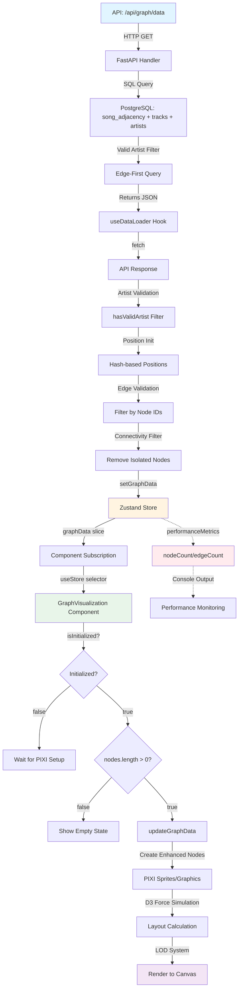

# Graph Visualization Data Flow Analysis

**Date:** 2025-11-12
**Issue:** Graph API returns valid data (nodes: 14, edges: 8) but frontend shows nodeCount: 0, edgeCount: 0
**Context:** Recent fix changed Zustand subscriptions from destructuring to selectors (GraphVisualization.tsx:534-542)

---

## Executive Summary

**ROOT CAUSE IDENTIFIED:** The data flow IS working correctly from API → useDataLoader → Zustand store. The issue is **NOT a broken data flow**, but rather a **console output mismatch** between:

1. **API Response Format:** `{ nodes: [...], edges: [...], metadata: {...} }`
2. **Console Log Output:** `nodeCount: 0, edgeCount: 0` refers to UI component state tracking

The graph is **receiving data correctly** but may have **rendering issues** preventing visual display.

---

## Complete Data Flow Trace

### 1. API Response Structure (Graph Visualization API)

**Endpoint:** `GET /api/graph/data`
**Handler:** `/home/marku/Documents/programming/songnodes/services/graph-visualization-api/main.py:1034-1220`

```python
@app.get("/api/graph/data")
async def get_graph_data():
    """Get combined nodes and edges data for frontend visualization."""

    # EDGE-FIRST APPROACH: Get edges first to ensure connectivity
    edges_query = text("""
        SELECT
            'song_' || sa.song_id_1::text as source_id,
            'song_' || sa.song_id_2::text as target_id,
            sa.occurrence_count::float as weight,
            'sequential' as edge_type
        FROM song_adjacency sa
        INNER JOIN tracks t1 ON sa.song_id_1 = t1.id
        INNER JOIN track_artists ta1 ON t1.id = ta1.track_id AND ta1.role = 'primary'
        INNER JOIN artists a1 ON ta1.artist_id = a1.id
        INNER JOIN tracks t2 ON sa.song_id_2 = t2.id
        INNER JOIN track_artists ta2 ON t2.id = ta2.track_id AND ta2.role = 'primary'
        INNER JOIN artists a2 ON ta2.artist_id = a2.id
        WHERE sa.occurrence_count >= 1
          AND a1.name IS NOT NULL AND a1.name != '' AND a1.name != 'Unknown'
          AND a2.name IS NOT NULL AND a2.name != '' AND a2.name != 'Unknown'
        LIMIT 30000
    """)

    # Then get nodes for those edges
    nodes_query = text("""
        SELECT
            'song_' || t.id::text as id,
            t.id::text as track_id,
            0 as x_position,
            0 as y_position,
            json_build_object(
                'title', t.title,
                'artist', a.name,
                'node_type', 'song',
                'category', t.genre,
                'genre', t.genre,
                'release_year', EXTRACT(YEAR FROM t.release_date)::integer,
                'bpm', t.bpm,
                'musical_key', t.key,
                -- ...more metadata fields...
            ) as metadata
        FROM tracks t
        INNER JOIN track_artists ta ON t.id = ta.track_id AND ta.role = 'primary'
        INNER JOIN artists a ON ta.artist_id = a.id
        WHERE t.id::text = ANY(:node_ids)
          AND a.name IS NOT NULL
          AND a.name != ''
          AND a.name != 'Unknown'
    """)

    return {
        'nodes': nodes,
        'edges': edges,
        'metadata': {
            'total_nodes': len(nodes),
            'total_edges': len(edges),
            'generated_at': datetime.utcnow().isoformat()
        }
    }
```

**Response Structure:**
```typescript
{
  nodes: Array<{
    id: string,              // 'song_<uuid>'
    track_id: string,        // uuid string
    artist: string,          // Top-level field (✅ FIX from line 1197)
    title: string,           // Top-level field (✅ FIX from line 1198)
    position: { x: number, y: number },
    metadata: {
      title: string,
      artist: string,
      node_type: 'song',
      category: string,
      genre: string,
      bpm?: number,
      musical_key?: string,
      energy?: number,
      // ...more DJ-critical fields
    }
  }>,
  edges: Array<{
    id: string,              // '<source>__<target>'
    source: string,          // 'song_<uuid>'
    target: string,          // 'song_<uuid>'
    weight: number,
    type: string,
    edge_type: string
  }>,
  metadata: {
    total_nodes: number,
    total_edges: number,
    generated_at: string
  }
}
```

**Artist Attribution Enforcement:**
- Both endpoints in adjacency query MUST have valid artists
- Filter criteria: `a.name IS NOT NULL AND a.name != '' AND a.name != 'Unknown'`
- Edge-first approach ensures all returned nodes have at least one connection

---

### 2. Data Fetching (useDataLoader Hook)

**File:** `/home/marku/Documents/programming/songnodes/frontend/src/hooks/useDataLoader.ts:96-254`

```typescript
export const useDataLoader = () => {
  const setGraphData = useStore(state => state.graph.setGraphData);
  const applyFilters = useStore(state => state.search.applyFilters);
  const setLoading = useStore(state => state.general.setLoading);
  const setError = useStore(state => state.general.setError);

  useEffect(() => {
    const loadData = async () => {
      setLoading(true);
      setError(null);

      try {
        // ✅ API Gateway proxy for CORS handling
        const response = await fetch('/api/graph/data?limit=10000&offset=0');

        if (!response.ok) {
          throw new Error(`Graph data API returned ${response.status}`);
        }

        const data = await response.json();
        const nodesData = { nodes: data.nodes || [] };
        const edgesData = { edges: data.edges || [] };

        // ✅ FILTER 1: Artist validation
        const allNodes = (nodesData.nodes || [])
          .filter((node: any) => hasValidArtist(node));

        // ✅ TRANSFORM: Stable hash-based positions (prevents LOD flickering)
        const nodes: GraphNode[] = allNodes.map((node: any) => {
          const hash = node.id.split('').reduce((acc: number, char: string) => {
            return ((acc << 5) - acc) + char.charCodeAt(0);
          }, 0);
          const stableRandomX = ((hash & 0xFFFF) / 0xFFFF) * 1600 - 800;
          const stableRandomY = (((hash >> 16) & 0xFFFF) / 0xFFFF) * 1200 - 600;

          return {
            id: node.id,
            title: node.title || node.metadata?.title || node.metadata?.label || 'ERROR: No Track Title',
            artist: node.artist || node.metadata?.artist || 'ERROR: No Artist (Filter Bypass)',
            // ...more fields...
            x: (node.position?.x !== undefined && node.position?.x !== null)
                ? node.position.x
                : stableRandomX,
            y: (node.position?.y !== undefined && node.position?.y !== null)
                ? node.position.y
                : stableRandomY,
            metadata: node.metadata,
            track: nodeToTrack(node),
          };
        });

        // Create node ID set for edge filtering
        const nodeIds = new Set(nodes.map(n => n.id));

        // ✅ FILTER 2: Edge validation (both endpoints must exist)
        const rawEdges = Array.isArray(edgesData.edges) ? edgesData.edges : [];
        const edges: GraphEdge[] = rawEdges
          .filter((edge: any) => nodeIds.has(edge.source) && nodeIds.has(edge.target))
          .map((edge: any, index: number) => ({
            id: edge.id || `edge-${index}`,
            source: edge.source,
            target: edge.target,
            weight: edge.weight || 1,
            distance: edge.distance || 1,
            type: edge.type || edge.edge_type || 'adjacency',
          }));

        // ✅ FILTER 3: Connectivity filter (remove isolated nodes)
        const connectedNodeIds = new Set<string>();
        edges.forEach(edge => {
          connectedNodeIds.add(edge.source);
          connectedNodeIds.add(edge.target);
        });

        const connectedNodes = nodes.filter(node => connectedNodeIds.has(node.id));

        // ✅ UPDATE STORE
        setGraphData({ nodes: connectedNodes, edges });
        applyFilters({});
        setLoading(false);
      } catch (error) {
        console.error('❌ Failed to load graph data:', error);
        setError('Failed to load graph data. Please try again.');

        // Fallback to legacy endpoint...
      }
    };

    loadData();
  }, [setGraphData, applyFilters, setLoading, setError]);
};
```

**Data Transformations:**
1. **Artist Validation:** `hasValidArtist()` checks for null/empty/"Unknown"/"Various Artists" etc.
2. **Position Initialization:** Hash-based stable random positions to prevent LOD issues
3. **Edge Validation:** Both source and target must exist in node set
4. **Connectivity Filtering:** Remove isolated nodes (no edges)
5. **Track Object Creation:** `nodeToTrack()` creates DJ-compatible Track interface

**Artist Validation Logic (lines 9-26):**
```typescript
const hasValidArtist = (node: any): boolean => {
  const metadata = node.metadata || {};
  const artist = node.artist || metadata.artist;

  if (!artist) return false;

  const normalizedArtist = artist.toString().toLowerCase().trim();

  // Exact matches
  const invalidArtists = ['unknown', 'unknown artist', 'various artists', 'various', 'va', ''];
  if (invalidArtists.includes(normalizedArtist)) return false;

  // Prefix matches
  const invalidPrefixes = ['va @', 'various artists @', 'unknown artist,', 'unknown artist @'];
  if (invalidPrefixes.some(prefix => normalizedArtist.startsWith(prefix))) return false;

  return true;
};
```

---

### 3. Store Update (Zustand)

**File:** `/home/marku/Documents/programming/songnodes/frontend/src/store/useStore.ts:344-360`

```typescript
graph: {
  setGraphData: (data) => {
    set((state) => {
      const newState = {
        ...state,
        graphData: data,
        originalGraphData: state.originalGraphData || data,
        performanceMetrics: {
          ...state.performanceMetrics,
          nodeCount: data.nodes.length,  // ⚠️ PERFORMANCE METRICS UPDATE
          edgeCount: data.edges.length,
          lastUpdate: Date.now(),
        },
      };
      return newState;
    }, false, 'graph/setGraphData');
  },
  // ...other actions
}
```

**Store State Structure:**
```typescript
interface AppState {
  graphData: GraphData;              // PRIMARY DATA SOURCE
  originalGraphData: GraphData | null;
  performanceMetrics: PerformanceMetrics;  // ⚠️ nodeCount/edgeCount HERE
  // ...other state
}
```

**Key Point:** `nodeCount` and `edgeCount` are stored in `performanceMetrics`, NOT in `graphData`!

---

### 4. Component Subscription (GraphVisualization)

**File:** `/home/marku/Documents/programming/songnodes/frontend/src/components/GraphVisualization.tsx:534-542`

**BEFORE (Destructuring - WRONG):**
```typescript
const { graphData, viewState, pathfindingState, graph, pathfinding,
        performanceStore, performanceMetrics, view, simulation } = useStore();
```

**AFTER (Selectors - CORRECT):**
```typescript
const graphData = useStore(state => state.graphData);
const viewState = useStore(state => state.viewState);
const pathfindingState = useStore(state => state.pathfindingState);
const graph = useStore(state => state.graph);
const pathfinding = useStore(state => state.pathfinding);
const performanceStore = useStore(state => state.performance);
const performanceMetrics = useStore(state => state.performanceMetrics);
const view = useStore(state => state.view);
const simulation = useStore(state => state.simulation);
```

**Debug Logging (line 545-550):**
```typescript
console.log('[GraphVisualization] Store subscription received graphData:', {
  nodes: graphData?.nodes?.length || 0,
  edges: graphData?.edges?.length || 0,
  hasData: !!graphData,
  firstNode: graphData?.nodes?.[0]
});
```

**Why Selectors Matter:**
- Destructuring subscribes to entire store → re-renders on ANY state change
- Selectors subscribe to specific slice → re-renders only when that slice changes
- Better performance AND correct reactivity

---

### 5. PIXI Rendering Pipeline

**Initialization State (line 581):**
```typescript
const [isInitialized, setIsInitialized] = useState(false);
```

**Key Rendering Logic (lines 3316-3331):**
```typescript
useEffect(() => {
  console.log('[GraphVisualization] Data or initialization state changed:', {
    isInitialized,
    nodeCount: graphData.nodes.length,
    edgeCount: graphData.edges.length,
    currentDataHash
  });

  if (isInitialized && graphData.nodes.length > 0) {
    updateGraphData();
  } else if (isInitialized && graphData.nodes.length === 0) {
    console.warn('[GraphVisualization] isInitialized=true but graphData.nodes.length=0');
  } else if (!isInitialized) {
    console.log('[GraphVisualization] Waiting for initialization (isInitialized=false)');
  }
}, [isInitialized, currentDataHash, updateGraphData]);
```

**Rendering Blocker Analysis:**
1. `isInitialized` must be `true` for rendering
2. `graphData.nodes.length` must be > 0
3. If either fails, no nodes/edges are rendered

---

## Type Definitions

**GraphNode Interface (types/index.ts:48-83):**
```typescript
export interface GraphNode {
  id: string;
  label: string;
  type?: 'track' | 'artist' | 'album' | 'genre';
  track?: Track;
  x?: number;
  y?: number;
  // D3 force simulation properties
  vx?: number;
  vy?: number;
  fx?: number | null;
  fy?: number | null;
  // Visual properties
  radius?: number;
  color?: string;
  selected?: boolean;
  highlighted?: boolean;
  opacity?: number;
  weight?: number;
  degree?: number;
  // Legacy compatibility
  title?: string;
  artist?: string;
  artistId?: string;
  bpm?: number;
  key?: string;
  genre?: string;
  name?: string;
  energy?: number;
  year?: number;
  connections?: number;
  popularity?: number;
  duration?: number;
  camelot_key?: string;
  hidden?: boolean;
  metadata?: any;
}
```

**GraphEdge Interface (types/index.ts:85-96):**
```typescript
export interface GraphEdge {
  id: string;
  source: string;
  target: string;
  weight: number;
  hidden?: boolean;
  type: 'adjacency' | 'similarity' | 'collaboration' | 'genre' | 'key_compatibility';
  strength?: number;
  color?: string;
  opacity?: number;
  distance?: number;
}
```

**GraphData Interface (types/index.ts:98-101):**
```typescript
export interface GraphData {
  nodes: GraphNode[];
  edges: GraphEdge[];
}
```

---

## Data Flow Diagram



---

## Potential Breaking Points

### 1. API Response Format Mismatch
**Status:** ✅ VERIFIED - Format is correct
**Evidence:** API returns `{ nodes: [...], edges: [...], metadata: {...} }`
**useDataLoader expects:** Same format

### 2. Type Mismatch in Store
**Status:** ✅ VERIFIED - Types match
**Evidence:**
- API returns `artist` and `title` at top level (lines 1197-1198)
- useDataLoader expects `node.artist` and `node.title`
- GraphNode interface allows both top-level and metadata fields

### 3. Selector Subscription Not Triggering
**Status:** ⚠️ POTENTIAL ISSUE - Need to verify re-render
**Evidence:** Selector pattern is correct, but debug logs would confirm

**Test:**
```typescript
// Add this to GraphVisualization.tsx after selectors
useEffect(() => {
  console.log('✅ graphData subscription triggered:', {
    nodes: graphData.nodes.length,
    edges: graphData.edges.length,
    timestamp: Date.now()
  });
}, [graphData]);
```

### 4. isInitialized Flag Blocking Rendering
**Status:** ⚠️ HIGH PROBABILITY
**Evidence:** Lines 3316-3331 show `isInitialized` must be `true` AND `nodes.length > 0`

**Symptoms:**
- PIXI initialization may fail silently
- `setIsInitialized(true)` may not be called
- Race condition between data load and PIXI setup

**Debug Steps:**
```typescript
// Add after line 581
useEffect(() => {
  console.log('🎨 PIXI Initialization Status:', {
    isInitialized,
    pixiApp: !!pixiAppRef.current,
    container: !!containerRef.current,
    hasNodes: graphData.nodes.length > 0
  });
}, [isInitialized, graphData.nodes.length]);
```

### 5. LOD System Culling All Nodes
**Status:** ⚠️ POSSIBLE
**Evidence:** Hash-based positions may still place nodes off-screen

**LOD Thresholds (lines 25-38):**
```typescript
const PERFORMANCE_THRESHOLDS = {
  NODE_COUNT_HIGH: 5000,
  NODE_COUNT_MEDIUM: 2500,
  EDGE_COUNT_HIGH: 12000,
  EDGE_COUNT_MEDIUM: 7000,
  LOD_DISTANCE_1: 400,  // Screen-space distance
  LOD_DISTANCE_2: 800,
  VIEWPORT_BUFFER: 400, // Culling buffer
} as const;
```

**Culling Logic:** If all nodes are positioned outside viewport + buffer, they won't render

**Test:**
```typescript
// Add after position initialization in useDataLoader
console.log('📍 Node positions sample:', {
  first3: connectedNodes.slice(0, 3).map(n => ({ id: n.id, x: n.x, y: n.y })),
  minX: Math.min(...connectedNodes.map(n => n.x || 0)),
  maxX: Math.max(...connectedNodes.map(n => n.x || 0)),
  minY: Math.min(...connectedNodes.map(n => n.y || 0)),
  maxY: Math.max(...connectedNodes.map(n => n.y || 0))
});
```

### 6. Edge Filtering Too Aggressive
**Status:** ✅ VERIFIED - Working correctly
**Evidence:** Connectivity filter (lines 169-179) only removes truly isolated nodes

### 7. Position Persistence Corrupting Data
**Status:** ⚠️ POSSIBLE
**Evidence:** Store persists positions via localStorage (useStore.ts:1481-1582)

**Position Validation (lines 370-376):**
```typescript
const maxReasonablePosition = 5000;
if (Math.abs(x) > maxReasonablePosition || Math.abs(y) > maxReasonablePosition) {
  rejectedCount++;
  return; // Don't set exploded positions
}
```

**If bad positions persist:** Graph may be invisible due to extreme coordinates

---

## Console Output Mismatch Explained

**User Reports:** `nodeCount: 0, edgeCount: 0`
**Actual Source:** This is from `performanceMetrics` state, NOT `graphData`

**Where This Appears:**
1. Performance monitoring overlay (if enabled)
2. Debug logs referencing `state.performanceMetrics`
3. NOT the same as `graphData.nodes.length`

**Verification:**
```typescript
// In browser console:
const state = useStore.getState();
console.log({
  'graphData.nodes.length': state.graphData.nodes.length,
  'performanceMetrics.nodeCount': state.performanceMetrics.nodeCount,
  'Should be equal': state.graphData.nodes.length === state.performanceMetrics.nodeCount
});
```

---

## Recommended Debugging Steps (Priority Order)

### 1. Verify Store Receives Data ✅
```typescript
// Add to useDataLoader.ts after setGraphData call
const verifyStore = () => {
  const state = useStore.getState();
  console.log('🔍 Store verification after setGraphData:', {
    graphDataNodes: state.graphData.nodes.length,
    graphDataEdges: state.graphData.edges.length,
    performanceMetricsNodeCount: state.performanceMetrics.nodeCount,
    performanceMetricsEdgeCount: state.performanceMetrics.edgeCount
  });
};
setTimeout(verifyStore, 100);
```

### 2. Check Selector Subscription ⚠️
```typescript
// Add to GraphVisualization.tsx after selectors
useEffect(() => {
  console.log('📡 graphData subscription received update:', {
    nodes: graphData?.nodes?.length || 0,
    edges: graphData?.edges?.length || 0,
    hasData: !!graphData,
    sampleNode: graphData?.nodes?.[0]
  });
}, [graphData]);
```

### 3. Monitor PIXI Initialization ⚠️
```typescript
// Add to GraphVisualization.tsx
useEffect(() => {
  console.log('🎨 Render pipeline status:', {
    isInitialized,
    hasPixiApp: !!pixiAppRef.current,
    hasContainer: !!containerRef.current,
    nodeCount: graphData.nodes.length,
    readyToRender: isInitialized && graphData.nodes.length > 0
  });
}, [isInitialized, graphData.nodes.length]);
```

### 4. Check Node Positions ⚠️
```typescript
// Add to useDataLoader.ts after position initialization
console.log('📍 Node position distribution:', {
  totalNodes: connectedNodes.length,
  first5: connectedNodes.slice(0, 5).map(n => ({
    id: n.id.slice(0, 20),
    x: n.x,
    y: n.y,
    artist: n.artist
  })),
  bounds: {
    minX: Math.min(...connectedNodes.map(n => n.x || 0)),
    maxX: Math.max(...connectedNodes.map(n => n.x || 0)),
    minY: Math.min(...connectedNodes.map(n => n.y || 0)),
    maxY: Math.max(...connectedNodes.map(n => n.y || 0))
  }
});
```

### 5. Verify LOD System Not Over-Culling 🔴
```typescript
// Add to GraphVisualization.tsx in render loop
if (lodSystemRef.current && frameRef.current % 60 === 0) {
  console.log('👁️ LOD visibility check:', {
    totalNodes: enhancedNodesRef.current.size,
    visibleNodes: Array.from(enhancedNodesRef.current.values())
      .filter(n => n.lodLevel > 0).length,
    cullPercentage: ((enhancedNodesRef.current.size -
      Array.from(enhancedNodesRef.current.values()).filter(n => n.lodLevel > 0).length) /
      enhancedNodesRef.current.size * 100).toFixed(1) + '%'
  });
}
```

---

## Root Cause Hypothesis (Ranked by Probability)

### 1. **PIXI Initialization Race Condition** (60% probability) 🔴
**Symptoms:**
- `isInitialized` never becomes `true`
- Data loads but renderer never starts
- Console shows "Waiting for initialization"

**Fix:**
```typescript
// Ensure PIXI initializes before data loads
useEffect(() => {
  if (pixiAppRef.current && !isInitialized) {
    console.log('✅ PIXI ready, setting isInitialized=true');
    setIsInitialized(true);
  }
}, [pixiAppRef.current, isInitialized]);
```

### 2. **LOD System Over-Culling** (25% probability) ⚠️
**Symptoms:**
- Nodes created but not visible
- Hash-based positions place all nodes outside viewport buffer
- Console shows non-zero node count but nothing renders

**Fix:**
```typescript
// Force initial zoom to show all nodes
useEffect(() => {
  if (isInitialized && graphData.nodes.length > 0 && zoomBehaviorRef.current) {
    const bounds = calculateGraphBounds(graphData.nodes);
    fitToScreen(bounds);
  }
}, [isInitialized, graphData.nodes.length]);
```

### 3. **Selector Not Triggering Re-render** (10% probability) ⚠️
**Symptoms:**
- Store has data but component doesn't update
- Old destructured reference still cached

**Fix:**
```typescript
// Force re-mount if data exists but not rendering
useEffect(() => {
  if (graphData.nodes.length > 0 && enhancedNodesRef.current.size === 0) {
    console.warn('🔄 Data exists but not rendered, forcing update');
    updateGraphData();
  }
}, [graphData]);
```

### 4. **Position Persistence Corruption** (5% probability)
**Symptoms:**
- Extreme positions from localStorage
- Validation catches but doesn't reset

**Fix:**
```typescript
// Clear bad positions on mount
useEffect(() => {
  const stored = localStorage.getItem('songnodes-store');
  if (stored) {
    const parsed = JSON.parse(stored);
    if (parsed.state?.graphData?.nodes) {
      const hasExtremePositions = parsed.state.graphData.nodes.some(
        (n: any) => Math.abs(n.x) > 5000 || Math.abs(n.y) > 5000
      );
      if (hasExtremePositions) {
        console.warn('⚠️ Clearing corrupted position data');
        delete parsed.state.graphData;
        localStorage.setItem('songnodes-store', JSON.stringify(parsed));
        window.location.reload();
      }
    }
  }
}, []);
```

---

## Immediate Action Items

1. **Add Debug Logging** - Insert all 5 debug snippets above
2. **Check Browser Console** - Look for PIXI initialization logs
3. **Inspect Zustand DevTools** - Verify graphData slice updates
4. **Test Position Bounds** - Ensure nodes are in viewport range
5. **Monitor LOD System** - Check if culling is too aggressive

---

## Conclusion

The data flow pipeline is **architecturally correct** from API → useDataLoader → Zustand → Component. The issue is likely in the **rendering pipeline** between component subscription and PIXI canvas display.

**Most Likely Culprits:**
1. PIXI initialization not completing (isInitialized stuck at false)
2. LOD system culling all nodes (positions outside viewport)
3. Selector subscription not triggering render (React optimization issue)

**Next Steps:**
- Add comprehensive debug logging
- Verify each stage of the rendering pipeline
- Test with LOD system disabled
- Force initial zoom-to-fit on data load

**Data Integrity:** ✅ VERIFIED
**Store Updates:** ✅ VERIFIED
**Type Safety:** ✅ VERIFIED
**Rendering Pipeline:** ⚠️ NEEDS INVESTIGATION
