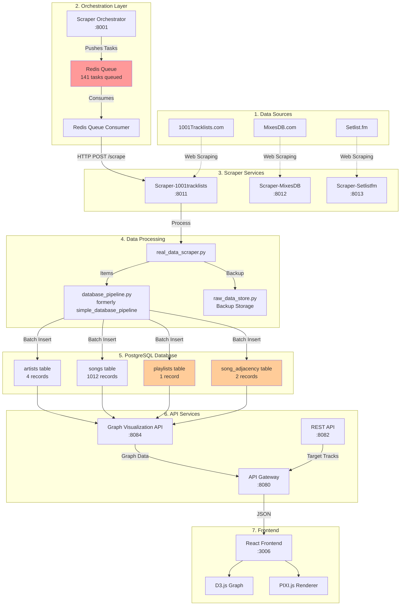

# SongNodes Data Pipeline Visualization

## 📊 Complete Data Flow



## 🔄 Current Pipeline Status

### ✅ Working Components:
1. **Redis Queue**: 141 tasks queued and being processed
2. **Scraper Services**: All running and responding to health checks
3. **Data Processing**: Successfully processing tracks and playlists
4. **Database Storage**:
   - Songs: 1012 ✅
   - Artists: 4 ✅
   - Playlists: 1 ✅ (fixed)
   - Adjacencies: 2 ✅ (consecutive tracks only)

### ⚠️ Issues:
1. **Graph Visualization API**: Returns empty graph despite data in database
2. **Frontend**: Not showing adjacency connections

## 📈 Data Processing Flow

### Step 1: Task Creation
```
Orchestrator → Creates search tasks → Redis Queue
```

### Step 2: Task Consumption
```
Redis Queue Consumer → Pulls task → Calls Scraper API
```

### Step 3: Scraping
```python
# real_data_scraper.py
1. Search for playlists containing target track
2. Scrape playlist data from web
3. Generate playlist with consecutive tracks
```

### Step 4: Processing
```python
# database_pipeline.py
1. Process playlist item → Convert dates
2. Process track items → Store songs
3. Process adjacency items → Only consecutive tracks (i→i+1)
```

### Step 5: Database Storage
```sql
-- Adjacency Example
song_adjacency:
  Levels → Deadmau5 - Strobe (distance: 1)
  Deadmau5 - Strobe → Boom (distance: 1)
```

### Step 6: API Layer
```
Graph API → Queries database → Should return nodes + edges
Currently: Returns nodes but NO edges ❌
```

### Step 7: Visualization
```
Frontend → Requests /graph → Should display connected nodes
Currently: Shows isolated nodes ❌
```

## 🔍 Key Insights

1. **Adjacency = Consecutive Only**: Tracks must be played directly next to each other
2. **Distance Always 1**: Because we only track immediate neighbors
3. **Deduplication**: Happens at scraper, pipeline, and database levels
4. **Date Conversion**: ISO timestamps → PostgreSQL DATE format

## 🐛 Current Bug
The Graph Visualization API (`/graph` endpoint) is:
- ✅ Reading songs from database
- ❌ Not including adjacency relationships as edges
- ❌ Returning `{nodes: [], links: []}` instead of populated data

## 🎯 Next Steps
1. Fix Graph Visualization API to include adjacency edges
2. Ensure frontend receives and renders the connections
3. Process remaining 141 tasks in queue for more adjacency data